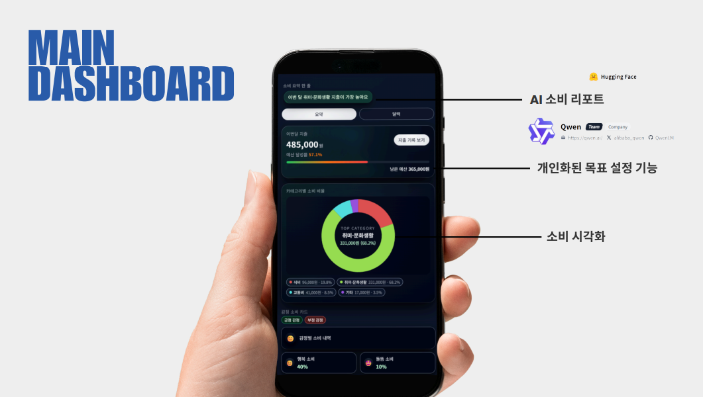
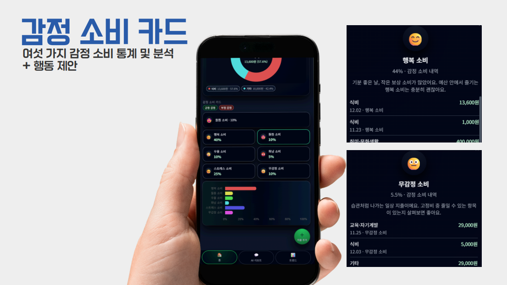
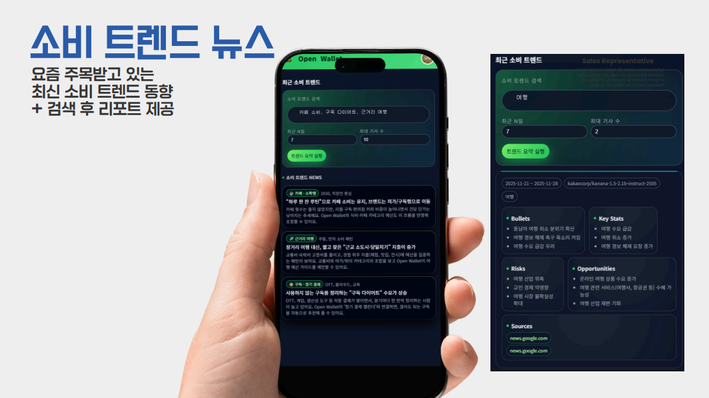
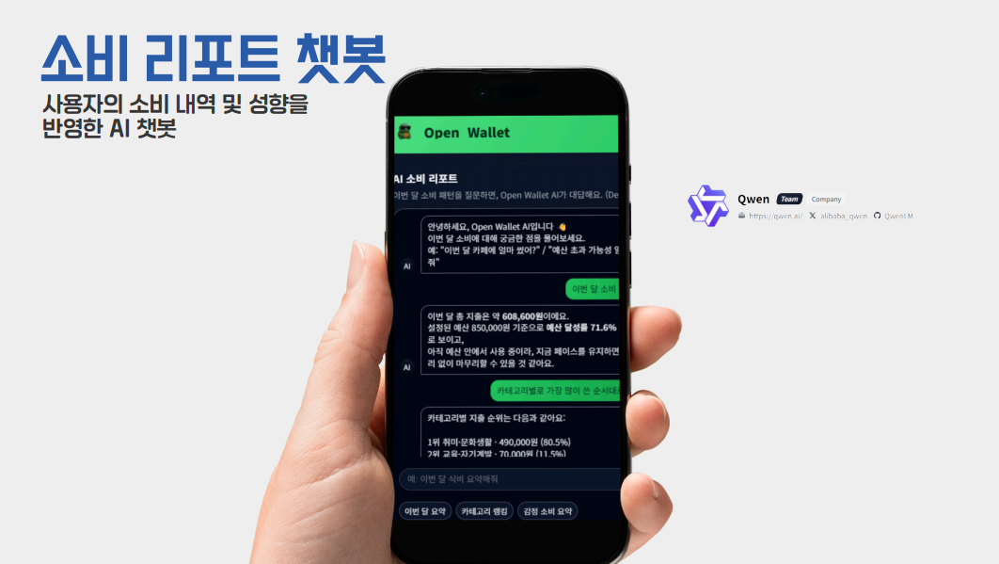
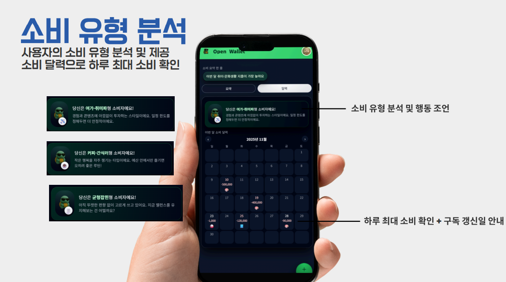
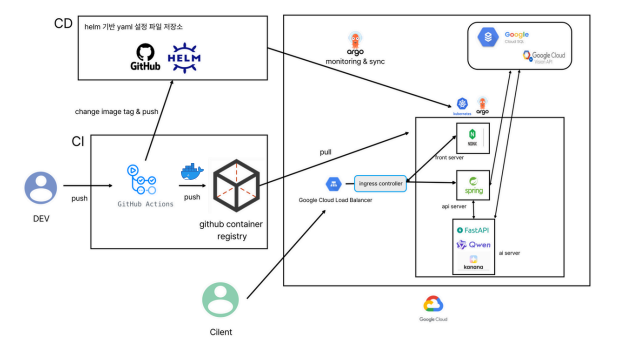

# 🖥️ OpenWallet_BE

> **AI 기반 스마트 소비 관리 앱 — OpenWallet의 백엔드**  
OpenWallet_BE는 **Spring Boot 기반**의 백엔드로,
> - FE 요청을 수신하고
> - OpenWallet_AI(FastAPI)·OCR·결제/구독 등 외부 서비스를 안전하게 호출하며
> - 공통 응답 스키마와 예외 규약을 제공합니다.

---
## Key Features

| 기능 | 설명 |
|------|-----|
| 📸 영수증 OCR 분석 | 금액/가게명/날짜/항목 추출 및 카테고리 추천 |
| 😊 감정 기반 소비 분석 | 감정/만족도 기반 소비 성향 진단 |
| 📈 소비 유형 & 달력 분석 | 패턴 인사이트 + 구독일 자동 추적 |
| 📰 소비 트렌드 뉴스 | 최신 트렌드 뉴스 수집 + 요약 |
| 🤖 AI 소비 리포트 | 사용자 맞춤 소비 성향 분석 + 행동 제안 |

---

## Screenshots

### 📊 Dashboard – 소비 시각화  


### 😊 감정 소비 카드  


### 📰 소비 트렌드 뉴스  


### 🤖 AI 소비 리포트 챗봇  


### 📈 소비 유형 분석 & 소비 달력  


---

## Architecture

```
[Frontend App]
↓ REST API
[Backend Gateway (Spring)]
↓
[OpenWallet AI Server - FastAPI]
├ OCR (Google Vision)
├ Emotion + Pattern Analysis
├ Trend News Summarizer (Kanana)
└ LLM Consumption Report (Qwen)

✔ 실시간 분석 & 자동화된 AI 파이프라인  
✔ 앱 → 백엔드 → AI 서버 완전 연동
```
---

## Deployment

| 구성 요소 | 기술 |
|------|------|
| Server | FastAPI |
| Cloud | Google Kubernetes Engine |
| CI/CD | GitHub Actions + ArgoCD |
| LLM | Qwen & Kanana |
| Registry | GitHub Container Registry |

---

## ✨ Vision
- 단순 기록이 아닌, 나를 이해하는 소비 분석 AI
- 소비 습관을 더 건강하게 변화시키는 인공지능
